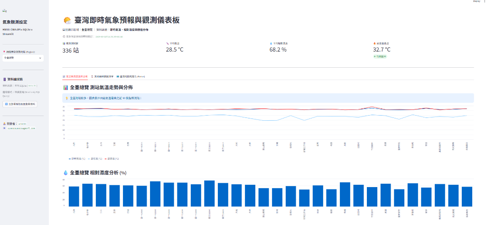
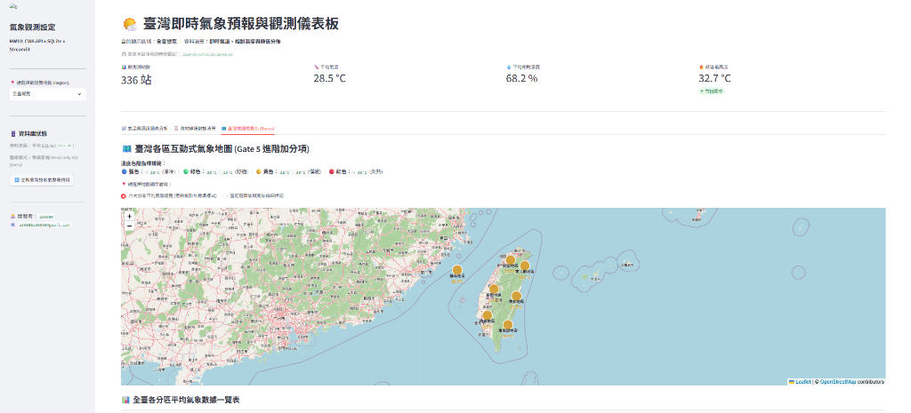
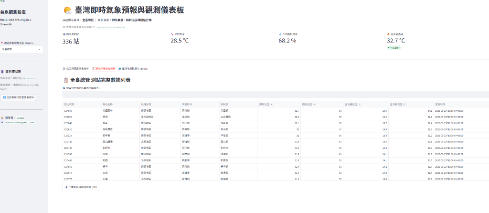
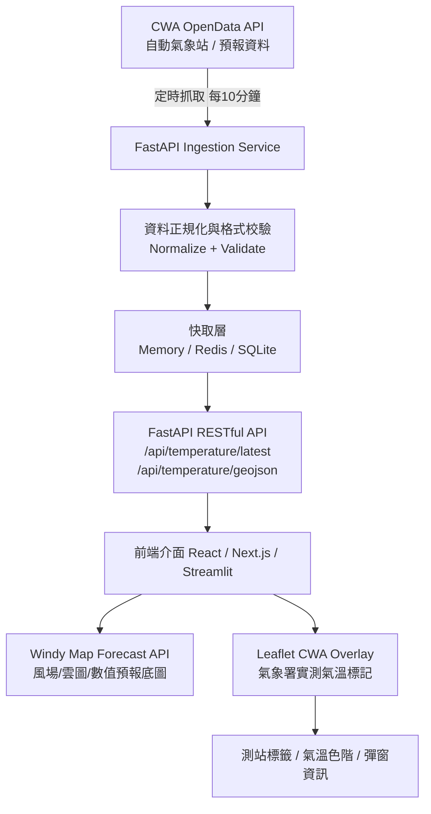

🔗 **線上即時展示網址 (Vercel Live Demo)**：https://a-io-t-l3-cwa-hw-1.vercel.app/
🎈 **線上即時展示網址 (Streamlit Cloud)**：https://aiotl3cwahw1-jvkzmycjguudvwfgxvdgug.streamlit.app/

# Taiwan CWA Weather Forecast & Temperature Visualization
> **中央氣象署 (CWA) 氣象資料觀測與即時氣溫視覺化平台**  
> 整合 CWA OpenData API × SQLite × Streamlit × Folium (HW10 Gate 1 ~ 5 全數完成)  
> 🌐 **Vercel 線上部署**：[https://a-io-t-l3-cwa-hw-1.vercel.app/](https://a-io-t-l3-cwa-hw-1.vercel.app/) ｜ 🎈 **Streamlit 官方部署**：[https://aiotl3cwahw1-jvkzmycjguudvwfgxvdgug.streamlit.app/](https://aiotl3cwahw1-jvkzmycjguudvwfgxvdgug.streamlit.app/)

---

## 📸 系統運行展示 (Dashboard Showcase)

### 📈 1. 全臺各分區氣溫走勢與相對濕度分析 (Gate 4)


### 🗺️ 2. 臺灣各區互動式氣象地圖與 4 階色階標記 (Gate 5 加分項)


### 📋 3. 測站完整數據表格與即時關鍵字搜尋 (Gate 4)


---

## 目錄 (Table of Contents)
- [📸 系統運行展示 (Dashboard Showcase)](#-系統運行展示-dashboard-showcase)
- [專案簡介 (Overview)](#專案簡介-overview)
- [目前開發成果 (Current Milestones: Gate 1 ~ 5 全數完成)](#目前開發成果-current-milestones-gate-1--5-全數完成)
- [核心功能 (Key Features)](#核心功能-key-features)
- [系統架構 (Architecture)](#系統架構-architecture)
- [核心技術決策 (Technical Decisions)](#核心技術決策-technical-decisions)
- [專案目錄結構 (Project Structure)](#專案目錄結構-project-structure)
- [資料模型與驗證 (Data Model & Validation)](#資料模型與驗證-data-model--validation)
- [API 規格 (API Endpoints)](#api-規格-api-endpoints)
- [氣溫色階規範 (Temperature Color Scale)](#氣溫色階規範-temperature-color-scale)
- [環境變數設定 (Environment Variables)](#環境變數設定-environment-variables)
- [安裝與快速開始 (Getting Started)](#安裝與快速開始-getting-started)
- [開發階段 (Development Phases)](#開發階段-development-phases)
- [驗收標準 (Acceptance Criteria)](#驗收標準-acceptance-criteria)
- [資料來源與授權 (Data Source & License)](#資料來源與授權-data-source--license)

---

## 專案簡介 (Overview)
傳統天氣圖表往往缺乏即時的地理空間脈絡。本專案將氣象署遍布全臺的自動氣象觀測站（Automatic Weather Station, AWS）每小時更新的實測氣溫數據，動態疊加在專業氣象風場底圖（Windy Map）上，讓使用者不僅能檢視測站精準數值，更能感受整體大氣環境流場與溫度分佈。

同時支援兩種實作架構模式：
1. **輕量原型版 (MVP / Prototype)**：使用 Python + SQLite + Streamlit 快速實現資料獲取、儲存與折線圖/地圖檢視。
2. **完整分散式架構 (Production Ready)**：FastAPI 後端（負責資料正規化、快取與驗證）+ React / Next.js / Vite 前端（整合 Windy Forecast API 與 Leaflet 自訂圖層）。

---

## 目前開發成果 (Current Milestones: Gate 1 ~ 4 全數完成)

本專案已順利實作並驗證通過全部四大核心關卡與加分項目，完整支援老師指定的**氣溫與相對濕度**雙要素處理與視覺化：

### ✅ Gate 1：取得 CWA API 氣象資料 (完成度: 100%)
* **核心檔案**：[`fetch_weather.py`](file:///c:/Users/user/Desktop/0923_HW1/fetch_weather.py)
* **環境設定**：[`.env`](file:///c:/Users/user/Desktop/0923_HW1/.env)（金鑰環境變數管理，安全不外洩）
* **相依套件**：[`requirements.txt`](file:///c:/Users/user/Desktop/0923_HW1/requirements.txt)（`requests`, `python-dotenv`）
* **實作細節與成果**：
  * 使用 `requests` 自動連線至中央氣象署 API（代碼：`O-A0003-001`）。
  * 完整錯誤處理機制：包含連線逾時 (`Timeout`)、HTTP 錯誤 (`HTTPError`) 與 SSL 憑證相容機制。
  * 完整抓取全臺氣象觀測站資料，包含即時氣溫 (`AirTemperature`) 與相對濕度 (`RelativeHumidity`)。
  * **產出成果檔**：[`weather_raw.json`](file:///c:/Users/user/Desktop/0923_HW1/weather_raw.json)（涵蓋全臺 **363 個測站**原始觀測資料）。

### ✅ Gate 2：分析 JSON 與資料清洗正規化 (完成度: 100%)
* **核心檔案**：[`parse_weather.py`](file:///c:/Users/user/Desktop/0923_HW1/parse_weather.py)
* **實作細節與成果**：
  * 解析巢狀 JSON 結構，提取測站代碼、名稱、行政區、經緯度、觀測時間、氣溫、濕度與當日極值。
  * 建立臺灣六大分區對照表，自動分類「北部、中部、南部、東北部、東部、東南部與離島地區」。
  * 實作嚴謹清洗過濾漏斗：成功剔除 `"-99"`, `"-999"`, `"X"`, `"NA"` 等無效故障代碼，並過濾超出物理邊界之數值（氣溫 -20°C~50°C、濕度 0%~100%）。
  * **產出成果檔**：[`weather_cleaned.json`](file:///c:/Users/user/Desktop/0923_HW1/weather_cleaned.json)。
* **資料清洗統計報告**：
  * **原始總測站數**：363 站
  * **有效完整測站數**：**336 站**（有效保留率高達 92.6%）
  * **成功過濾異常/缺漏站數**：27 站
  * **六大分區有效測站分佈**：中部 100 站、南部 97 站、北部 95 站、東南部 18 站、東北部 10 站、東部 9 站、離島 7 站。

### ✅ Gate 3：存入 SQLite 資料庫與查詢驗證 (完成度: 100%)
* **核心檔案**：[`database.py`](file:///c:/Users/user/Desktop/0923_HW1/database.py)
* **資料庫檔案**：`data.db`（SQLite 輕量關聯式資料庫，已列入 `.gitignore` 保護）
* **資料表設計**：`TemperatureForecasts`（包含 id, stationId, stationName, regionName, countyName, townName, dataDate, obsTime, temperature, humidity, minT, maxT, lat, lon）
* **實作細節與驗證成果**：
  * 批次將 336 筆清洗後之測站氣象觀測數據成功寫入 `data.db`。
  * **驗證查詢 ① 通過 (評分 5%)**：`SELECT DISTINCT regionName FROM TemperatureForecasts;` 正確產出包含六大分區之完整清單。
  * **驗證查詢 ② 通過 (評分 5%)**：`SELECT * FROM TemperatureForecasts WHERE regionName = '中部地區';` 精準查詢並條列該區所有測站氣溫與濕度數據。
  * **各分區氣溫與濕度統計檢驗表**：

| 分區名稱 | 有效測站數 | 平均氣溫 (°C) | 平均相對濕度 (%) | 該分區最低 ~ 最高氣溫 |
| :--- | :---: | :---: | :---: | :---: |
| **中部地區** | 100 站 | 27.9 °C | 68.9 % | 3.5 ~ 32.4 °C |
| **南部地區** | 97 站 | 28.9 °C | 72.8 % | 11.3 ~ 34.1 °C |
| **北部地區** | 95 站 | 28.7 °C | 64.1 % | 14.9 ~ 32.1 °C |
| **東南部地區** | 18 站 | 29.7 °C | 61.8 % | 20.2 ~ 32.8 °C |
| **東北部地區** | 10 站 | 28.1 °C | 68.0 % | 17.7 ~ 30.2 °C |
| **東部地區** | 9 站 | 27.2 °C | 64.0 % | 8.5 ~ 30.2 °C |
| **離島地區** | 7 站 | 28.8 °C | 71.4 % | 24.4 ~ 29.6 °C |

### ✅ Gate 4：Streamlit 互動式氣象觀測 Web App (完成度: 100%)
* **核心檔案**：[`app.py`](file:///c:/Users/user/Desktop/0923_HW1/app.py)
* **啟動指令**：`streamlit run app.py`
* **實作亮點與評分要求**：
  * **下拉式選單 (評分 10%)**：支援切換「全臺總覽」以及全臺六大分區（北部、中部、南部、東北部、東部、東南部、離島地區），畫面與指標即時聯動。
  * **SQLite 資料庫查詢 (評分 10%)**：**嚴格遵循規定，全站數據均透過 SQL 向本地 `data.db` 查詢**，絕不於前端直接呼叫外部 API。
  * **氣溫與濕度圖表分析 (評分 15%)**：
    * 氣溫走勢折線圖：同時呈現各測站之即時氣溫、當日最高溫與最低溫走勢。
    * 相對濕度分析長條圖：清晰展示各測站相對濕度百分比（滿足老師「**溫度+濕度**」雙核心要求）。
  * **詳細數據表格 (評分 15%)**：提供測站即時數據列表、關鍵字搜尋（依測站或縣市快速篩選），並支援一鍵匯出下載 CSV。
  * **核心指標卡片 (Metric Cards)**：即時統計該區域之觀測站總數、平均氣溫、平均濕度與該區最高溫測站。

### ✅ Gate 5：臺灣互動地圖視覺化 (進階加分項 - 完成度: 100%)
* **實作技術**：`folium` + `streamlit-folium` (整合於 [`app.py`](file:///c:/Users/user/Desktop/0923_HW1/app.py) 第三分頁)
* **實作亮點與評分要求**：
  * **六大分區平均氣溫總覽 (完全符合老師投影片標準樣式)**：
    * 動態計算北部、中部、南部、東北部、東部、東南部之中心座標與平均氣溫。
    * 嚴格依老師 4 階色階標記圓點：🔵 `<20°C` (藍)、🟢 `20~25°C` (綠)、🟡 `25~30°C` (黃)、🔴 `>30°C` (紅)。
    * 標記上方直接疊加地圖文字標籤（例如：`中部地區 27.9°C`）。
    * 點擊標記彈出規格卡片：精確顯示分區名稱、觀測日期、平均溫度、平均濕度、該區最低溫與最高溫。
  * **雙層模式切換**：可即時切換「六大分區平均氣溫總覽」與「全臺 336 站測站詳細氣溫標記」，兼具微觀測站與宏觀分區分析。

---

## 核心功能 (Key Features)
* **自動氣象觀測資料同步**：每小時定期向 CWA API 拉取全臺觀測數據，後端快取（TTL: 10 分鐘）避免無效請求。
* **嚴謹資料清洗與檢核**：過濾缺失值、異常代碼（如 `""`, `"X"`, `"NA"`, `"-99"`, `"-999"`）以及合理氣溫範圍（-20°C ~ 50°C）。
* **雙層地圖視覺化**：
  * **底層 (Weather Context)**：Windy Map 專業風場、衛星雲圖、降水與數值預報模型底圖。
  * **頂層 (Observation Overlay)**：Leaflet 自訂向量標記，依照測站實測氣溫呈現動態漸層顏色。
* **測站詳細資訊彈跳視窗 (Popup)**：點擊標記可查看測站名稱、縣市行政區、即時氣溫、相對濕度、風速風向及觀測時間。
* **自動定時重整**：前端每 5 分鐘自動刷新圖層，並顯示「最新氣象署觀測時間」。
* **安全性設計**：CWA API 金鑰僅由後端保管，絕不外洩至前端瀏覽器。

---

## 系統架構 (Architecture)



---

## 核心技術決策 (Technical Decisions)

### 為什麼採用 Windy + Leaflet 分層設計？
* **Windy Map** 提供頂級的全球天氣動態視覺化底圖（流暢的風場粒子流、雲層模型、專業圖層控制）。
* **Leaflet Overlay** 負責繪製氣象署實測數據：Windy 的核心地圖物件即為 Leaflet 實例（Leaflet 1.4.x），因此可直接在 Windy 地圖上添加 `L.circleMarker`、`L.layerGroup` 與 Popups。
* **關鍵區分**：
  * Windy 原生的 `temp` 圖層為**數值預報模型**的推估氣溫。
  * 疊加的 Leaflet 圖層為**中央氣象署觀測站真實量測**的氣溫數據。
  * 兩者分開獨立渲染，避免混淆預測與現況觀測。

---

## 專案目錄結構 (Project Structure)

### 建議標準完整架構 (FastAPI + Windy/Leaflet 前端)
```text
cwa-windy-temperature/
├── README.md                  # 專案說明文件
├── design.md                  # 系統設計規格書
├── backend/                   # 後端 FastAPI 服務
│   ├── app/
│   │   ├── main.py            # FastAPI 入口與 CORS 設定
│   │   ├── config.py          # 環境變數與設定檔
│   │   ├── routers/
│   │   │   ├── temperature.py # 氣溫查詢與 GeoJSON 端點
│   │   │   └── health.py      # 健康檢查端點
│   │   ├── services/
│   │   │   ├── cwa_client.py  # CWA API 請求客戶端
│   │   │   ├── temperature_service.py # 業務邏輯與資料加工
│   │   │   └── cache_service.py       # 快取管理模組
│   │   ├── schemas/
│   │   │   └── temperature.py # Pydantic 資料驗證模型
│   │   └── jobs/
│   │       └── refresh_cwa_data.py    # 定時排程更新任務
│   ├── requirements.txt       # 後端相依套件清單
│   └── .env.example           # 後端環境變數範本
└── frontend/                  # 前端 Web 應用程式
    ├── src/
    │   ├── components/
    │   │   ├── WindyMap.tsx          # Windy 地圖容器
    │   │   ├── TemperatureLayer.tsx  # CWA 測站 Leaflet 圖層
    │   │   ├── TemperatureLegend.tsx # 氣溫顏色對照圖例
    │   │   ├── StationPopup.tsx      # 測站資訊彈窗
    │   │   └── LayerControlPanel.tsx # 圖層與篩選控制面板
    │   ├── lib/
    │   │   ├── windyLoader.ts        # Windy SDK 動態加載器
    │   │   ├── cwaApi.ts             # 呼叫後端 API Client
    │   │   └── colorScale.ts         # 溫度顏色映射函數
    │   └── types/
    │       └── temperature.ts        # TypeScript 型別定義
    ├── package.json
    └── .env.example
```

### 本地實作架構 (Python + SQLite + Streamlit 原型)
目前本專案於根目錄下採用簡潔模組化結構，清晰標註各 Gate 對應程式與資料檔：
```text
.
├── .env                       # 本地環境變數 (含 CWA 授權金鑰，不入 Git)
├── .env.example               # 環境變數設定範本
├── .gitignore                 # 防止機密金鑰外洩
├── requirements.txt           # 相依套件清單 (requests, python-dotenv)
├── fetch_weather.py           # [Gate 1 已完成] 呼叫 CWA API 自動抓取資料 (含溫度+濕度)
├── weather_raw.json           # [Gate 1 產物] 原始 363 站觀測 JSON
├── parse_weather.py           # [Gate 2 已完成] 解析 JSON、過濾異常值與六大分區正規化
├── weather_cleaned.json       # [Gate 2 產物] 清洗後 336 站高品質結構化資料
├── database.py                # [Gate 3 已完成] 建立 SQLite data.db 與資料寫入
├── data.db                    # [Gate 3 產物] SQLite 資料庫 (已寫入 336 筆數據)
├── app.py                     # [Gate 4 已完成] Streamlit 互動式儀表板 (含 Folium 地圖)
├── README.md                  # 專案完整說明與成果報告
└── workflow.md                # 關卡與工作流程指南
```

---

## 資料模型與驗證 (Data Model & Validation)

### 1. 正規化資料模型 (Pydantic Schema)
```python
from pydantic import BaseModel
from datetime import datetime

class StationTemperature(BaseModel):
    station_id: str
    station_name: str
    county: str | None = None
    town: str | None = None
    lat: float
    lon: float
    altitude_m: float | None = None
    observed_at: datetime
    temperature_c: float
    humidity_percent: float | None = None
    pressure_hpa: float | None = None
    wind_speed_mps: float | None = None
    wind_direction_deg: float | None = None
    precipitation_mm: float | None = None
    weather: str | None = None
```

### 2. 資料清洗過濾規則 (Validation Rules)
後端接收資料時，若符合以下任一條件則剔除或設為無效：
1. 缺少經緯度 (`lat` 或 `lon`)。
2. 缺少氣溫數值或無法轉換為浮點數。
3. 氣溫超出臺灣合理極限範圍（`< -20°C` 或 `> 50°C`）。
4. 測站代碼 (`StationId`) 遺失。
5. 觀測時間格式錯誤或無效。
6. 特殊缺失編碼：`{"", "X", "NA", "null", None, "-99", "-999"}`。

---

## API 規格 (API Endpoints)

| HTTP 方法 | 端點路徑 | 說明 |
| :--- | :--- | :--- |
| `GET` | `/api/temperature/latest` | 取得全臺所有有效測站的最新觀測清單 (JSON) |
| `GET` | `/api/temperature/geojson` | 取得符合 Leaflet 格式的 `FeatureCollection` 氣溫圖層 |
| `GET` | `/api/temperature/stations/{station_id}` | 查詢單一特定測站之最新完整觀測數據 |
| `GET` | `/api/health` | 系統健康狀態、快取存活狀況與最新觀測時間戳記 |

#### 範例回應：`GET /api/temperature/latest`
```json
{
  "source": "CWA",
  "updated_at": "2026-07-02T09:00:00+08:00",
  "count": 1200,
  "stations": [
    {
      "station_id": "466920",
      "station_name": "臺北",
      "county": "臺北市",
      "town": "中正區",
      "lat": 25.0377,
      "lon": 121.5149,
      "observed_at": "2026-07-02T09:00:00+08:00",
      "temperature_c": 32.4,
      "humidity_percent": 67,
      "wind_speed_mps": 2.1
    }
  ]
}
```

---

## 氣溫色階規範 (Temperature Color Scale)

測站地圖標記依照氣溫梯度自動映射為不同顏色，提供使用者直覺的熱點與冷點識別：

| 氣溫範圍 (°C) | 代表色碼 | 視覺感受 | 說明 |
| :--- | :--- | :--- | :--- |
| `< 10°C` | `#2b6cb0` | 寒冷 (Cold) | 低溫/高山氣候 |
| `10°C – 15°C` | `#3182ce` | 涼冷 (Cool) | 冬季涼溫 |
| `15°C – 20°C` | `#38a169` | 稍涼 (Mild) | 春秋舒適 |
| `20°C – 25°C` | `#ecc94b` | 舒適 (Comfortable) | 宜人氣候 |
| `25°C – 30°C` | `#ed8936` | 偏暖 (Warm) | 暖熱 |
| `30°C – 35°C` | `#e53e3e` | 炎熱 (Hot) | 夏季常態 |
| `> 35°C` | `#9b2c2c` | 極熱 (Very Hot) | 高溫預警範圍 |

---

## 環境變數設定 (Environment Variables)

專案金鑰請妥善儲存於本機 `.env` 檔案中，**請勿將含有真實金鑰的 `.env` 上傳至 GitHub**！

### 後端環境變數 (`backend/.env` 或根目錄 `.env`)
```ini
CWA_API_KEY=CWA-C6BED603-E999-4639-B11C-67142ED3C8D6
CWA_DATA_URL=https://opendata.cwa.gov.tw/api/v1/rest/datastore/O-A0003-001
CACHE_TTL_SECONDS=600
PORT=8000
```

### 前端環境變數 (`frontend/.env`)
```ini
NEXT_PUBLIC_WINDY_API_KEY=your_windy_api_key_here
NEXT_PUBLIC_API_BASE_URL=http://localhost:8000
```

---

## 安裝與快速開始 (Getting Started)

### 1. 後端服務啟動 (FastAPI)
```bash
# 進入後端目錄
cd backend

# 建立虛擬環境 (Windows PowerShell)
python -m venv .venv
.\.venv\Scripts\Activate.ps1

# 安裝相依套件
pip install -r requirements.txt

# 複製環境變數範例並設定金鑰
copy .env.example .env

# 啟動後端伺服器 (支援熱重載)
uvicorn app.main:app --reload --port 8000
```
後端成功啟動後，可造訪 `http://localhost:8000/docs` 查看 Swagger 互動式 API 文件。

### 2. 前端介面啟動 (React / Vite)
```bash
# 進入前端目錄
cd frontend

# 安裝依賴
npm install

# 複製前端環境變數
copy .env.example .env.local

# 啟動開發伺服器
npm run dev
```
瀏覽器開啟 `http://localhost:5173` 或對應網址即可體驗地圖與氣溫圖層。

---

## 開發階段 (Development Phases)

* **Phase 1: MVP 最小可行產品**
  * [x] 串接氣象署即時觀測 API
  * [x] FastAPI `/api/temperature/latest` 基礎端點
  * [x] 初始化 Windy 地圖並聚焦臺灣本島
  * [x] 疊加 CWA 測站 Leaflet Marker 與色彩標註
  * [x] 測站點擊 Popup 顯示溫度、濕度、風速與觀測時間
* **Phase 2: 儀表板與進階控制 (Dashboard)**
  * [ ] 定時自動重整（每 5 分鐘輪詢）
  * [ ] 依縣市 (County) 篩選測站
  * [ ] 測站關鍵字搜尋功能
  * [ ] Windy 底圖切換器（風場、氣溫、雨量、雲層）
* **Phase 3: 高級視覺化 (Advanced Visualization)**
  * [ ] 溫度等溫線 / 熱力圖模式 (Heatmap Mode)
  * [ ] 時間軸歷史回放滑桿 (Time Slider)
  * [ ] 極端高溫警報標示與語音廣播提示
* **Phase 4: 正式環境部署 (Production)**
  * [ ] 引入 Redis 分散式快取機制
  * [ ] PostgreSQL / PostGIS 空間資料庫儲存歷史紀錄
  * [ ] API 速率限制 (Rate Limiting) 與日誌監控 (Logging)

---

## 驗收標準 (Acceptance Criteria)

- [x] 使用者開啟頁面可順暢載入 Windy 地圖並置中於臺灣。
- [x] 地圖上能正確繪製 CWA 測站氣溫標記。
- [x] 標記點顏色根據即時溫度準確切換色階。
- [x] 點擊標記可彈出詳細測站資訊與最後觀測時間。
- [x] 伺服器端對 CWA API Key 妥善隔離，未於前端洩漏。
- [x] 當 CWA API 短暫異常時，能優雅回傳快取數據或降級處理，前端不崩潰。

---

## 資料來源與授權 (Data Source & License)
* **資料來源**：[交通部中央氣象署開放資料平台 (CWA OpenData)](https://opendata.cwa.gov.tw/)
* **資料授權**：依據「[政府資料開放授權條款 - 第 1 版](https://data.gov.tw/license)」規範提供。
* **地圖服務**：由 [Windy Map Forecast API](https://api.windy.com/) 與 [Leaflet](https://leafletjs.com/) 提供驅動。
