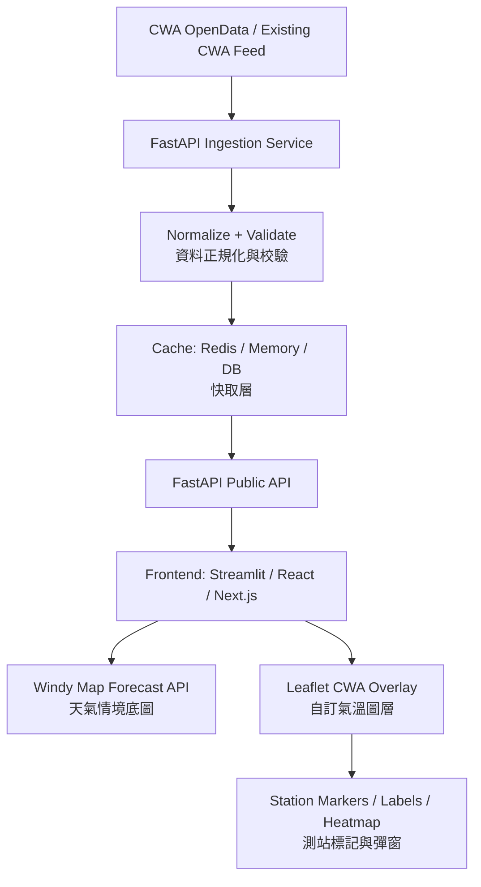
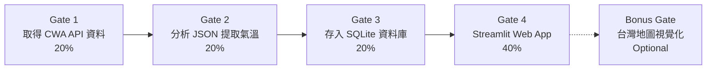
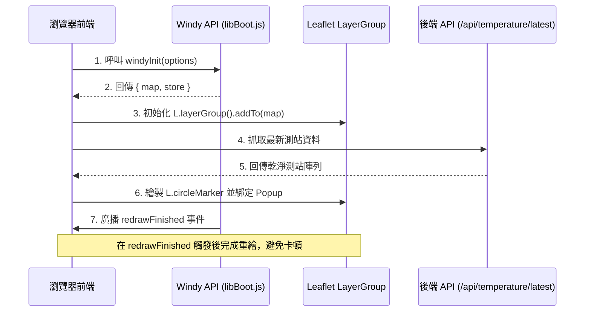

# 氣象預測專案工作流程 (Workflow & Gate Guide)
> **AI Vibe Coding：Forecast with CWA API**  
> 完整對應課程講義與系統規格書之各關卡 (Gates) 與開發階段 (Phases)。

---

## 目錄 (Table of Contents)
1. [系統總體架構圖 (Architecture)](#1-系統總體架構圖-architecture)
2. [HW10 核心作業關卡流程 (Course HW Gates)](#2-hw10-核心作業關卡流程-course-hw-gates)
   - [Gate 1: 取得 CWA API 資料 (20%)](#gate-1-取得-cwa-api-資料-20)
   - [Gate 2: 分析 JSON，提取氣溫資料 (20%)](#gate-2-分析-json提取氣溫資料-20)
   - [Gate 3: 存入 SQLite 資料庫 (20%)](#gate-3-存入-sqlite-資料庫-20)
   - [Gate 4: Streamlit 氣溫預報 Web App (40%)](#gate-4-streamlit-氣溫預報-web-app-40)
   - [Bonus Gate: 台灣地圖視覺化 (加分項)](#bonus-gate-台灣地圖視覺化-加分項)
3. [Part 5 進階系統開發階段 (System Development Gates)](#3-part-5-進階系統開發階段-system-development-gates)
   - [Phase 1: MVP 最小可行產品 (Gate 1 系統端)](#phase-1-mvp-最小可行產品-gate-1-系統端)
   - [Phase 2: Dashboard 儀表板 (Gate 2 系統端)](#phase-2-dashboard-儀表板-gate-2-系統端)
   - [Phase 3: Advanced Visualization 進階視覺化 (Gate 3 系統端)](#phase-3-advanced-visualization-進階視覺化-gate-3-系統端)
   - [Phase 4: Production 生產環境部屬 (Gate 4 系統端)](#phase-4-production-生產環境部屬-gate-4-系統端)
4. [資料清洗與校驗規則 (Data Validation Rules)](#4-資料清洗與校驗規則-data-validation-rules)
5. [地圖渲染與事件生命週期 (Windy & Leaflet Lifecycle)](#5-地圖渲染與事件生命週期-windy--leaflet-lifecycle)
6. [標準執行指令清單 (Execution Runbook)](#6-標準執行指令清單-execution-runbook)

---

## 1. 系統總體架構圖 (Architecture)

依據規格書第 5 節所設計之端到端架構：



---

## 2. HW10 核心作業關卡流程 (Course HW Gates)

本流程完整對照第 1 頁投影片之評分標準與四步驟執行鏈：



---

### Gate 1: 取得 CWA API 資料 (20%)
* **關卡目標**：使用 CWA API 取得台灣六大區域一週天氣預報（必須使用 JSON 格式）。
* **資料集代碼**：`F-A0010-001`
* **涵蓋區域**：北部地區、中部地區、南部地區、東北部地區、東部地區、東南部地區。
* **對應檔案**：`fetch_weather.py`
* **實作步驟**：
  1. 使用 `requests` 呼叫 CWA API，帶入授權 Header：
     ```python
     headers = {"Authorization": "CWA-C6BED603-E999-4639-B11C-67142ED3C8D6"}
     ```
  2. 使用 `json.dumps(data, indent=2, ensure_ascii=False)` 觀察並驗證回傳資料。
  3. 加入 HTTP 例外與錯誤處理邏輯。
* **評分配比**：取得資料 10% ｜ 錯誤處理 5% ｜ 程式品質 5%

---

### Gate 2: 分析 JSON，提取氣溫資料 (20%)
* **關卡目標**：分析 JSON 結構，找出並提取每日最高溫 (`MaxT`) 與最低溫 (`MinT`)。
* **對應檔案**：`parse_weather.py`
* **JSON 解析階層**：
  ```text
  records 
    └── locations 
          └── location (地區: 北部/中部/南部...)
                └── weatherElement (天氣要素)
                      └── time (預報日期)
                            ├── elementName: MinT (最低溫)
                            └── elementName: MaxT (最高溫)
  ```
* **提取目標格式**：
  | regionName | dataDate | minT | maxT |
  | :--- | :--- | :--- | :--- |
  | 北部地區 | 2026-04-14 | 18 | 26 |
  | 中部地區 | 2026-04-14 | 20 | 30 |
  | 南部地區 | 2026-04-14 | 22 | 31 |
* **評分配比**：提取正確 10% ｜ 數據完整 5% ｜ 程式品質 5%

---

### Gate 3: 存入 SQLite 資料庫 (20%)
* **關卡目標**：將清洗提取後的氣溫預報存入 SQLite 資料庫檔案。
* **資料庫名稱**：`data.db`
* **對應檔案**：`database.py`
* **資料表結構**：
  ```sql
  CREATE TABLE IF NOT EXISTS TemperatureForecasts (
      id INTEGER PRIMARY KEY AUTOINCREMENT,
      regionName TEXT,
      dataDate TEXT,
      minT REAL,
      maxT REAL
  );
  ```
* **查詢檢驗**：
  1. 列出所有地區：`SELECT DISTINCT regionName FROM TemperatureForecasts;`
  2. 查詢特定分區：`SELECT * FROM TemperatureForecasts WHERE regionName = '中部地區';`
* **評分配比**：儲存資料 10% ｜ 查詢檢驗 5% ｜ 程式品質 5%

---

### Gate 4: Streamlit 氣溫預報 Web App (40%)
* **關卡目標**：建立互動式 Web 儀表板，提供下拉選單選擇區域，繪製一週氣溫折線圖與完整表格。
* **對應檔案**：`app.py`
* **核心規定**：**必須從 SQLite 資料庫 (`data.db`) 查詢資料，不可於前端直接呼叫 API。**
* **功能清單**：
  1. **下拉式選單**：支援切換六大分區。
  2. **SQL 查詢整合**：根據選取區域執行 `SELECT` 撈取 7 天數據。
  3. **氣溫折線圖**：同時呈現一週內之 `MaxT` 與 `MinT` 走勢。
  4. **數據表格**：條列每日日期與最高/最低溫，數據需與折線圖一致。
* **評分配比**：下拉選單 10% ｜ 折線圖與表格 15% ｜ SQLite 查詢 10% ｜ 程式品質 5%

---

### Bonus Gate: 台灣地圖視覺化 (加分項)
* **關卡目標**：製作互動式地圖，依各分區當日平均氣溫呈現不同顏色（建議使用 `folium` + `streamlit`）。
* **色階規範**：
  * `< 20°C`：藍色
  * `20 – 25°C`：綠色
  * `25 – 30°C`：黃色
  * `> 30°C`：紅色

---

## 3. Part 5 進階系統開發階段 (System Development Gates)

依據規格書第 23 節與第 24 節之四階段工程規劃：

### Phase 1: MVP 最小可行產品 (Gate 1 系統端)
* **核心功能**：
  * FastAPI 核心端點：`GET /api/temperature/latest`
  * 初始化 Windy 地圖置中於臺灣 (`lat: 23.7, lon: 121.0, zoom: 7`)
  * 疊加 CWA 測站標記 (`L.circleMarker`)
  * 7 階氣溫色階圖例 (Temperature legend)
  * 測站詳細資訊彈窗 (Popup：站名、溫度、濕度、風速、觀測時間)
  * 手動資料刷新按鈕 (Manual refresh button)
* **MVP 10 項驗收檢核標準 (Acceptance Criteria)**：
  - [x] 使用者開啟頁面能看到 Windy 地圖
  - [x] 地圖置中於臺灣
  - [x] 測站標記點正確顯示
  - [x] 標記顏色隨氣溫階層變換
  - [x] 點擊標記顯示測站詳細彈窗
  - [x] 顯示氣象署最新觀測時間
  - [x] 支援手動更新資料
  - [x] 後端隱藏 CWA API Key，前端不洩漏
  - [x] CWA 缺漏資料時前端不崩潰
  - [x] 專案具備完整設定說明

### Phase 2: Dashboard 儀表板 (Gate 2 系統端)
* 自動定時重整（前端每 5 分鐘、後端每 10 分鐘快取）
* 縣市篩選器 (County filter)
* 測站關鍵字搜尋 (Station search)
* Windy 背景圖層切換器 (Wind, Temp, Rain, Clouds)
* 測站文字標籤開關 (Station label toggle)
* 系統健康狀態端點 (`GET /api/health`)

### Phase 3: Advanced Visualization 進階視覺化 (Gate 3 系統端)
* 熱力圖模式 (Heatmap mode)
* 時間軸歷史回放滑桿 (Time slider)
* 數值網格氣溫層 (Gridded temperature layer)
* 極端高溫警戒著色 (Alert threshold coloring)
* 行動裝置響應式介面 (Mobile-friendly UI)

### Phase 4: Production 生產環境部屬 (Gate 4 系統端)
* Redis 分散式快取
* PostgreSQL / PostGIS 空間資料庫
* API 限流 (Rate limiting)
* 結構化日誌 (Logging) 與監控 (Monitoring)
* 雲端平台部署 (Render / Vercel / Railway)

---

## 4. 資料清洗與校驗規則 (Data Validation Rules)

後端與資料處理腳本必須遵守規格書第 10 節之資料過濾漏斗：

```python
# 異常字串排除集合
INVALID_VALUES = {"", "X", "NA", "null", None, "-99", "-999"}

def parse_float(value):
    if value in INVALID_VALUES:
        return None
    try:
        return float(value)
    except (ValueError, TypeError):
        return None
```

* **剔除條件**：
  1. 缺少經緯度 (`lat` 或 `lon`)。
  2. 氣溫欄位缺失或無法轉為浮點數。
  3. 氣溫超出正常邊界：`< -20°C` 或 `> 50°C`。
  4. 測站 ID 遺失。
  5. 觀測時間無效。

---

## 5. 地圖渲染與事件生命週期 (Windy & Leaflet Lifecycle)



---

## 6. 標準執行指令清單 (Execution Runbook)

依據老師規格指引之標準執行步驟：

### 步驟 1：建立虛擬環境與安裝相依
```bash
# 建立虛擬環境
python -m venv venv

# 啟動虛擬環境 (Windows PowerShell)
.\venv\Scripts\Activate.ps1

# 安裝所需套件
pip install -r requirements.txt
```

### 步驟 2：依序執行資料處理管線 (一次即可)
```bash
# 1. 取得 API 資料並存為 JSON
python fetch_weather.py

# 2. 解析 JSON 並提取氣溫
python parse_weather.py

# 3. 建立 SQLite 並寫入資料
python database.py
```

### 步驟 3：啟動 Web App
```bash
# 啟動 Streamlit 互動式介面
streamlit run app.py
```
